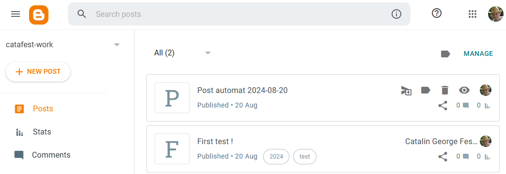

# test cu Google API pentru blogger 

You need *OAuth 2.0 Client IDs* because I need to post to blogger and ```googleapis``` is limited: 

Use to avoid 'punycode' :
```
node --no-deprecation src\index.js
```
Since punycode isn't directly installed in your project, see : ```npm ls punycode```, you can't simply uninstall it. The warning you're seeing is likely coming from a nested dependency.

To address this, you can try the following steps:

Update all your project dependencies to their latest versions. This might resolve the issue if newer versions of the dependencies have moved away from using punycode.

If the warning persists after updating, you can use the --no-deprecation flag when running your Node.js script to suppress deprecation warnings.

Alternatively, you could investigate which of your dependencies is using whatwg-url (as mentioned in the error stack trace) and see if there's an updated version or alternative that doesn't rely on punycode.

Remember, while addressing deprecation warnings is good practice, your code is still functioning correctly despite this warning.

The result is this: 


